# Practical exercise on data analysis

In this practical, you will perform steps needed on working environment setup for reproducible data analysis using the code versioning system `git`, systems environment management `renv` and `RMarkdown/Quarto` to create reproducible documents.

## Requirements

-   R and RStudio or [Posit Cloud](https://rstudio.cloud) account

## Step 1: Create your R project

1.  Start RStudio or login to the [Posit Cloud](https://rstudio.cloud)
2.  Select "New Project" -\> "New RStudio Project"

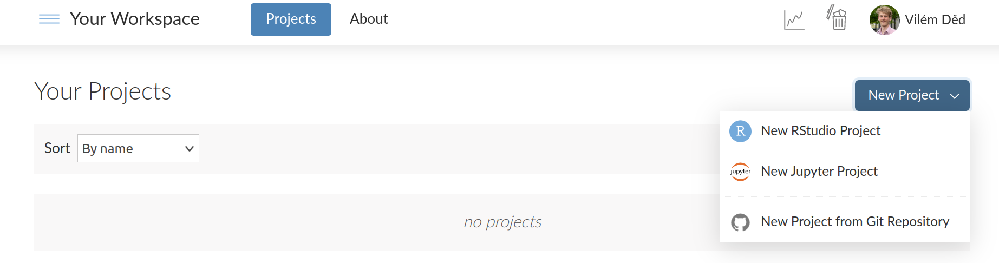

After a while, you should see Rstudio IDE environment with your project.

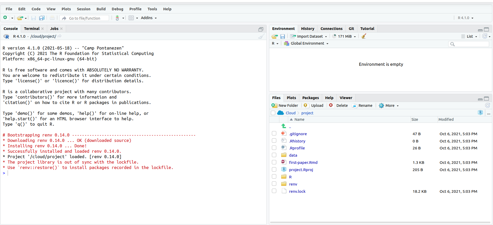

3.  To set up git versioning for your project click on "Tools \> Version Control \> Project setup".

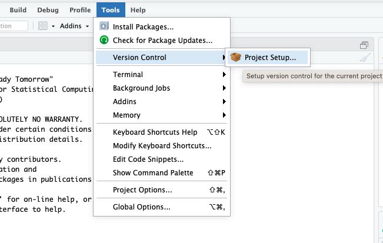

In the following window under Git/SVN for version control system select Git and save the change.

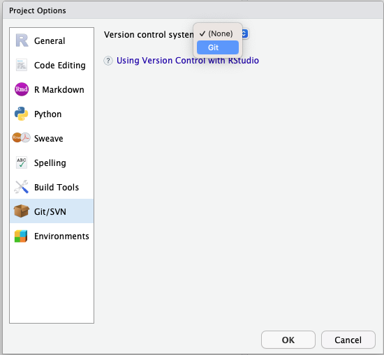

## Attention
If you are using **RStudio** and you **do not** have git as an option for code versioning you need to install it on your machine following next steps.
**Posit Cloud** users skip the installation part and please go to the **git configuration steps**.

### Git installation

**For Windows**

Please download Git Bash from [Git download](https://git-scm.com/downloads)

**For macOS**

Please install it (recommended) following instructions here: http://git-scm.com/downloads.

**For GNU/Linux**

Please run in the terminal:

````
sudo apt-get install git
````
### Git configuration - for both RStudio and Posit Cloud users!

To configure git in all machines and for both RStudio and Posit Cloud users, fill in the mandatory info.

Type in the terminal/Bash (update name/email):

````
git config --global user.name "Firstname Lastname"
git config --global user.email "yourEmail@server.com"
````

Check the configuration was successful by running:
````
git config --list
````
You should be able to see your user.name and user.email set accordingly.


## Step 2: Create your computational environment

1.  Your data analysis will require multiple packages. To use `renv` first run `install.packages("renv")` in the **console**. To start collecting the list of used packages in the project library initialize `renv` by running `renv::init()`. Inspect the renv.lock file.

2.  Install the tidyverse package `install.packages("tidyverse")`. Then run `renv::snapshot` to update the renv.lock file. Take a look at it again.

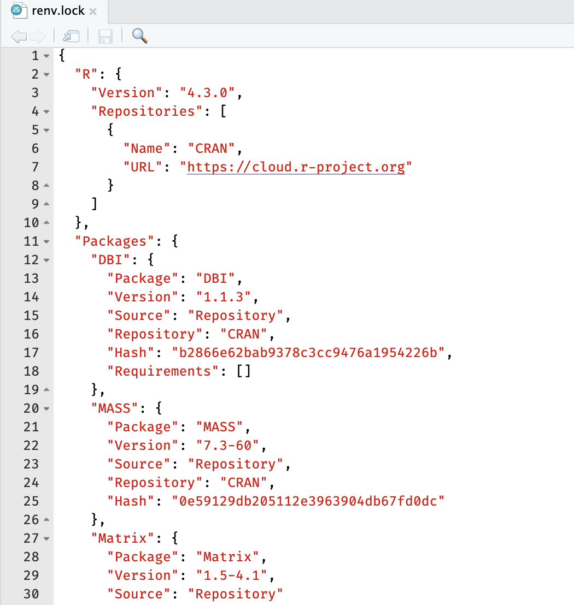

The project environment and all used packages will be installed in any other system by running the `renv::restore()` in the **console** tab.

## Step 3: Create project directory structure

1.  In your project directory make 2 directories called **data** and **R**.

2.  **Data** directory is where your ChiP-seq data from previous practicals should be placed.

3.  Download the [ChiP-seq data](https://raw.githubusercontent.com/elixir-luxembourg/project-setup-practical/master/data/TC1-ST2-D0.12_peaks.narrowPeak) into the data directory and name it **TC1-ST2-D0.12_peaks.narrowPeak**. The location and the name of your data file are important for the analysis-code.R to work!

4.  **R** directory is where you should create a new R Script and copy the code from the [analysis-code.R](https://raw.githubusercontent.com/elixir-luxembourg/project-setup-practical/master/R/analysis-code.R) from the given repository.

## Step 4: Git

1.  Inspect the **Git** tab and see the list of changes.

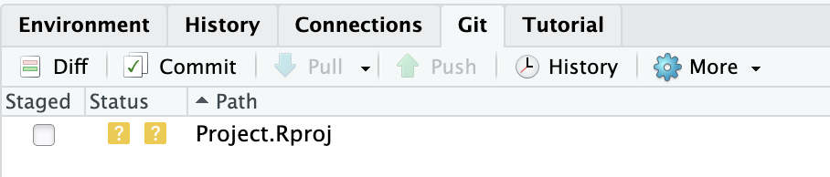

2.  Create the `first-paper.qmd` file. Copy the content of the [first-paper.qmd](<https://github.com/elixir-luxembourg/project-setup-practical/blob/master/first-paper.qmd>) into this file and save it. The file should appear in **Git** tab list.

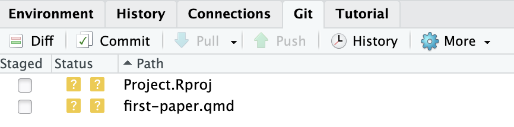

3.  Stage the changes for this file by checking the checkbox in `Stage` column. The green icon means it was added.

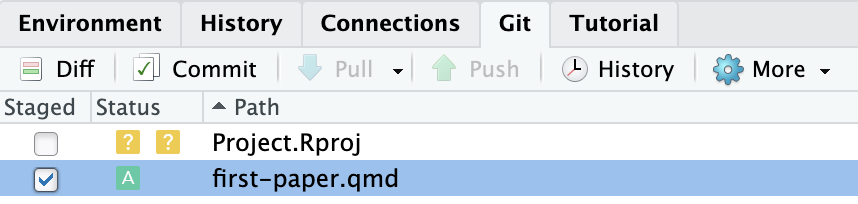

4.  Commit the addition of this file by clicking on `Commit`. You are prompted to review your changes. Add commit message and hit `commit`.

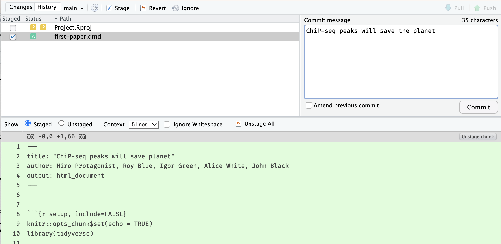

The file is no more listed in **Git** tab - naturally! It was commited.

5.  Update the list of authors in the first section - add your name ;) - and save it.

6.  Repeat the previous two steps. Stage the change of the file. The blue icon means it was modified.

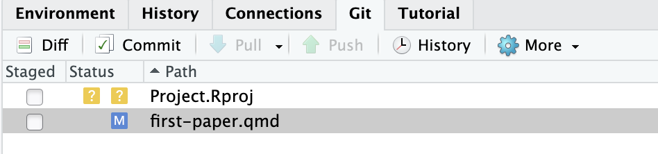

Now commit the change. You are prompted to review your changes. Add a commit message and hit commit.

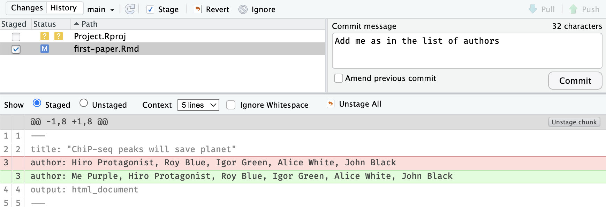

7.  Inspect history of the repository. Your commits should be the first. Inspect the metadata available for your commit - commit message, your name, date and commit hash (unique identifier).

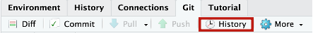

At this moment, you may want to push your changes to a remote repository (GitHub or Gitlab) to share the code for others for additional development. This is not covered in this practical.

## Literate programming

1.  Open the `first-paper.qmd` file saved in your project and hit `Render`.

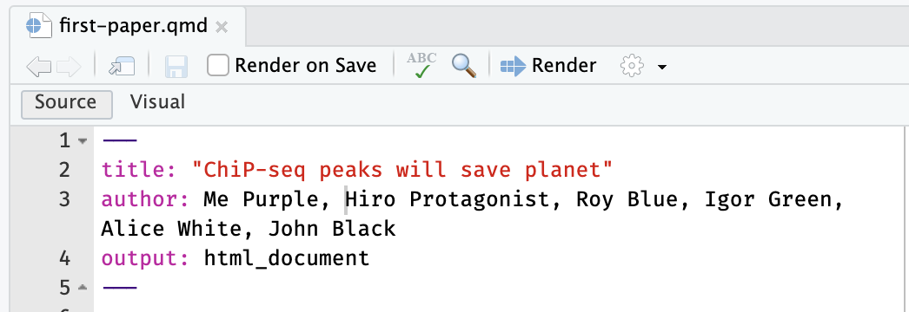

2.  Review the resulting html file. Update the content of the Quarto document.

    -   Switch the output format to Word

    -   Describe the statistics of the length of the peaks in a table

    -   Discuss the distribution of signal values and p values with one sentence that should contain the actual numbers.

    -   Include a citation.

        You can add new code chunks, update the text or add new pieces of code available in `R/analysis-code.R` file.

3.  Render the document again.

## Final Assignment

Download the generated `.docx` file and sent it to the trainer.
